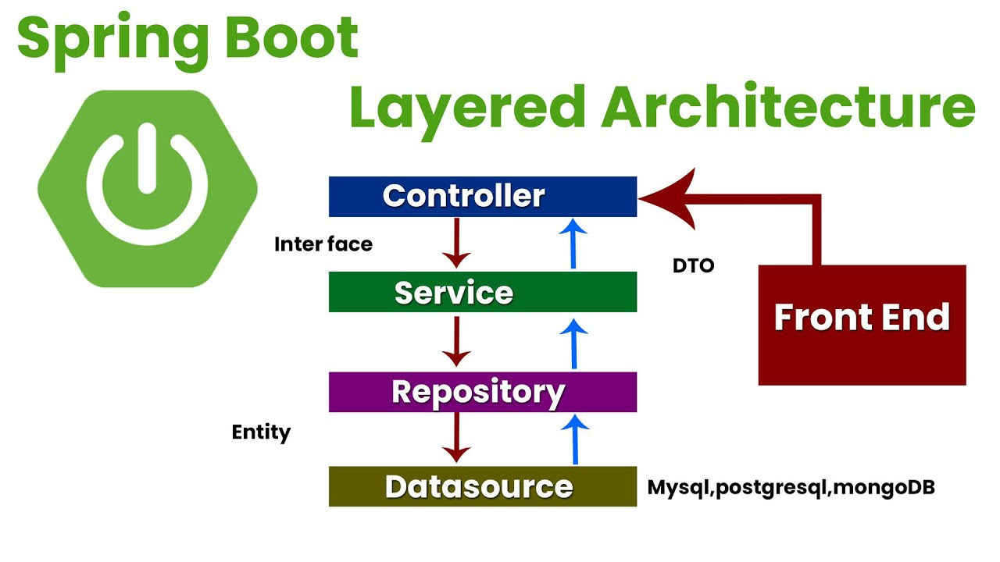

# Spring Boot Cheat Sheet
- [What is Framework](framework)
    - un ensemble de classes business et librairies pour faire une tâche dont le but est facilité une tache (connexion à une bdd)
    - assure que tout les développeur travaille de la même maniére en utilisant et respectant les même consigne. 

- [What is Spring](framework)
    - le framework java le plus ancien (2004), le plus connus, et le plus utiliser. 

- [What is Spring Boot](framework)
    - C'est un sous projet/module du framework Spring. (Spring Boot, Sprint Cloud, Spring Data..)
    - il offre une autoconfiguration 
    - Points clés pour comprendre le Spring boot : 
        - [Understand layers](###Application-layers) 
        - Understand Maven 
        - Understand MVC.
        - RestController and Controller.

### Application layers

- il est composé de 3 phases : 
    - Controller : manipulation de la rêquete utilisateur.
    - Business : traitement de la rêquete utilisateur.
    - Repository : intéragir avec la bdd :  
        - En écrivant une classe java avec des getters et setters pour échanger avec la bdd.
        - DTO : mirroir permet de transférer les données entre Entité (classe Java) et la bdd, concrétement il transforme l'entité en requête, et la requête en entité. 

